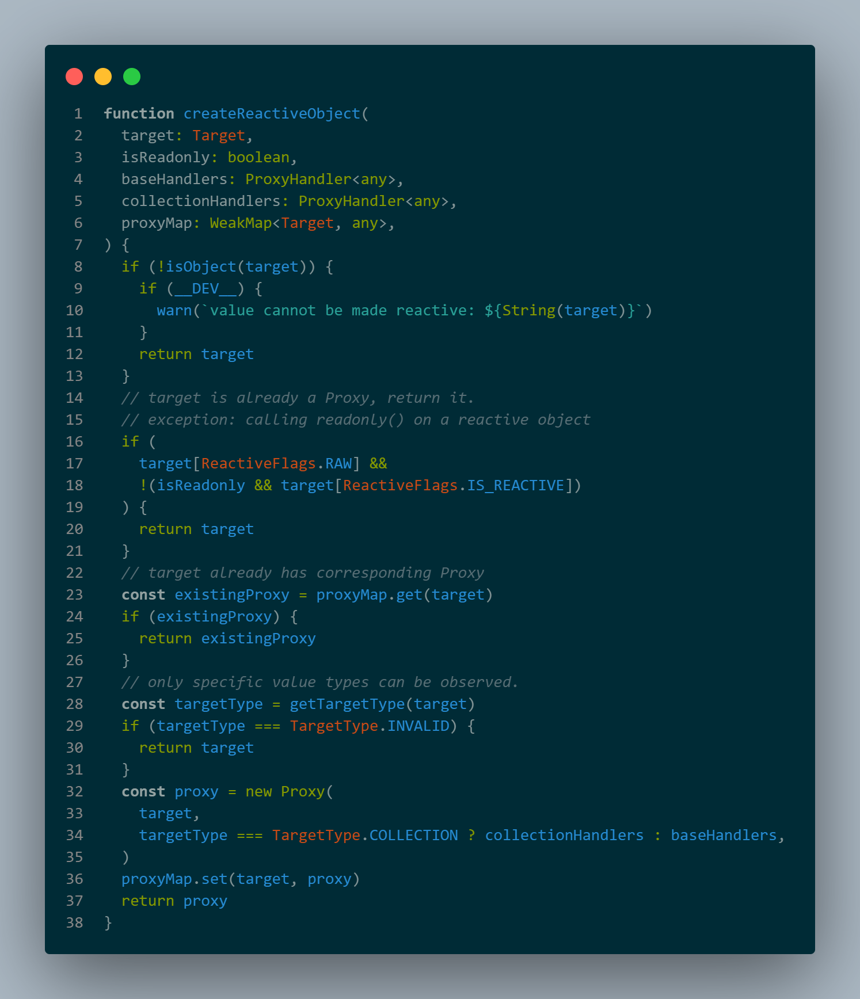
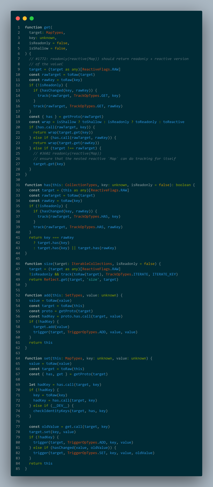
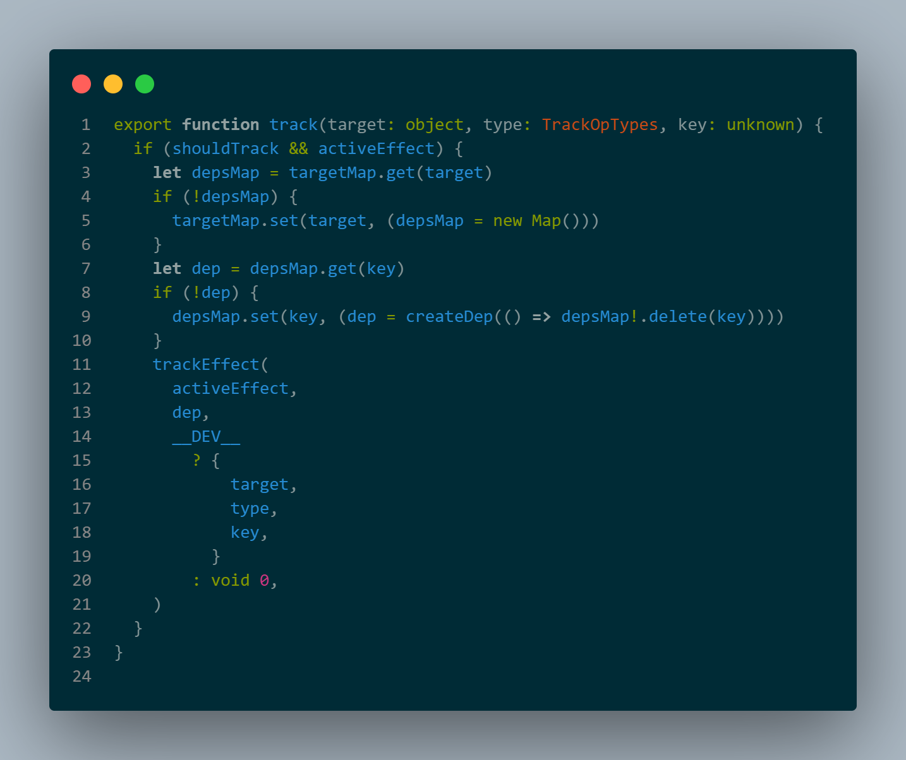

### Vue-reactive


记录一下Vue3.0的核心功能Reactive的阅读 


Vue2.0和3.0在区别跟重组上，效率上更加高效  源码更加直观，主要用Proxy和WeakMap来重写 


## Reactive


这个应该是最核心的代码


````
const a=reactive({
    a:5
})

````

这个api的作用是把对象包装成一个响应式对象 在包装的过程中需要注意的是 他只会先包装最上面的一层 

至于我们可能对象嵌套多层，例如a.a.b 会在反问a的时候就会重新对a进行一次Proxy



首先这里要去处_dev的代码，因为这个是开发环境做协调测试跟相关console的代码

ReactiveFlags.RAW:引用原始对象，判断是否中存在原始对象
IS_REACTIVE:字面子意思，是否是一个Reactive对象
这里面的ProxyMap是防止多次创建Reactive对象 而存在的 WeakMap

总结这里的代码 
- 首先判断这个对象是否是Proxy对象，如果是Proxy对象直接返回，
- 对象是一个Raw对象，并且这个对象已经被访问记录过到WeakMap那么就直接返回WeakMap中的
- 如果是一个无效对象，那么直接返回原对象
- 后面就是包装对象和set的逻辑
- 首先这里的Proxy的handler collectionHandlers这个是核心的Handler
所以这里就是一个判断对象是否被包装过并且返回对象的一个整体逻辑


 
前面的流水代码不叙述
- hasChange(key,rawKey) 什么情况下这个会不一样，key会是个reactive的时候，什么时候会成为一个reactive? 做一个深度访问属性的时候 比如a.b.c b也会是个proxy，但是这个的key和proxy是不一样的。
- track 这个函数想要明白需要拿另外一个 监听函数watchEffect 这个是依赖修改后的副作用调用函数

watchEffect(fn)

在调用的时候会创建一个ReactEffect对象 这个就是当前的effect对象，包括依赖的维护 还有各种重要信息都是保存在这个对象上，接着会把一些关键信息全部重置 把activeEffect设置成当前的ReactEffect对象，这样fn里的依赖可以精准的保存到当前对象，这里跟以前的Vue3.0和React hooks的实现有所不同，早起的Vue3.0是用数组 React是用链表来实现这种上下文的保存。

fn当中的依赖就会触发get操作，

